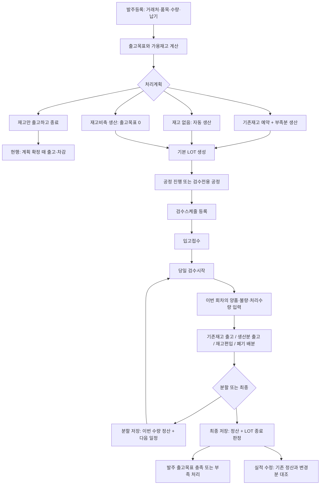

# MES 발주등록부터 검수실적 저장·수정까지의 규칙 정리안

작성일: 2026-09-10 / 검토용 초안 0.1 / 사용자 결정 3건 반영 / 코드·DB 적용 없음

현재 구현을 설명하는 내용과 앞으로 채택할 규칙안을 함께 정리했다. **‘개선안’과 ‘결정 필요’는 아직 확정·구현된 규칙이 아니다.** 사용자가 명확히 요청한 ‘양품·검수수량의 LOT 계획 초과 허용’은 새 규칙에서도 유지한다.

검토 근거는 현재 로컬 소스, 운영구조 문서, 사용자가 전달한 운영 서버 읽기 전용 보고서다. 운영 보고서의 DB 조회 기준은 2026-09-10 08:57:47 KST, 재확인은 08:59:32 KST다. 이 문서 작성 중 운영 DB를 새로 조회하거나 원격 PC를 조작하지 않았다. 운영에서 대조되지 않은 주변 기능은 **로컬 구현 기준**이며, 오류 PC 실행 버전은 여전히 미확인이다.

여기서 ‘발주’는 사용자 화면의 발주등록, 코드의 `order_line`(고객 수주 라인)을 뜻한다. 외주업체에 보내는 구매발주와 구분한다. 범위는 발주·처리계획·LOT·검수일정·검수결과·관련 재고/출고·수정/취소/종결이다. 외주공정 자체의 원가·구매발주 상세 규칙은 검수 인계에 필요한 조건만 포함한다.

읽는 순서: **1~10은 업무 순서**, **11~13은 공통 제약과 데이터 정리**, **14는 결정할 항목**, **15는 검증 기준**, **16은 근거 파일**이다.

사용자가 이번 검토에서 결정한 사항:

- **D01:** 계획 확정·검수 저장에서 실제 출고완료 및 재고 차감하는 현행 시점 유지.
- **D02:** 실제 처리수량이 LOT 계획보다 적어도 실제수량과 미달 사유를 기록하고 최종검수 종료 허용.
- **D04:** 재고생산은 순수 재고비축. 기존재고를 출고하지 않고 생산분을 재고로 보관.

## 1. 전체 업무 흐름



위 흐름의 ‘출고·차감 시점’은 **사용자 결정 D01에 따라 현행 유지**한다. 현재 재고비축 생산은 계획상 출고목표가 0이지만 검수 단계에 일관되게 적용되지 않는 오류가 있다.

## 2. 먼저 구분해야 할 수량과 상태

### 2.1 수량 사전

| 용어 | 의미 | 혼동하면 안 되는 것 |
|---|---|---|
| 발주수량 | 고객이 주문한 수량 또는 내부 재고생산 요청량 | 출고목표·실제생산량과 항상 같지 않음 |
| 출고목표 | 거래처별 가산 규칙까지 적용한 납품 목표 | LOT 계획수량과 별개 |
| LOT 계획수량 | 해당 LOT에서 생산하려던 계획 | 실제 검수수량의 상한이 아님 |
| 전체 현재재고 | 상품 단위로 기록된 물리 재고 잔액 | 예약됐다고 이 값이 줄지는 않음 |
| LOT별 현재재고 | 상품·LOT 조합별 물리 재고 잔액 | 상품 전체재고와 합계가 맞아야 함 |
| 예약재고 | 특정 발주에 배정됐지만 아직 출고하지 않은 재고 | 실제 출고나 재고 감소가 아님 |
| 신규 발주 가용재고 | 다른 발주에 예약되지 않은 사용 가능 재고 | 전체 현재재고 그대로 사용하면 중복 예약 |
| 이번 발주 사용가능재고 | 미예약 가용량 + 이 발주의 유효 예약량 | 다른 발주의 예약은 사용 불가 |
| 이번 양품 | **이번 회차에서 새로 검사한** 양품 | LOT 누적 양품을 다시 입력하지 않음 |
| 불량출고수량 | 불량이지만 출고 가능으로 판정한 수량 | 출고불가 불량과 서로 중복 집계하지 않음 |
| 불량수량 | 검사했으나 출고불가로 판정한 수량 | 양품 폐기·미검수와 구분 |
| 검사완료수량 | 양품 + 불량출고 + 출고불가 불량 | 미검수는 제외 |
| 미검수수량 | 현행에서는 검사 없이 처리 종료하며 폐기 통계에 포함하는 수량 | 다음 회차에 검사할 ‘검수대기 잔량’이 아님 |
| 이번 처리수량 | 검사완료수량 + 미검수수량 | 외주업체 출하수량·별도 입고확정 수량과 같다고 보장되지 않음 |
| 이번 판매가능수량 | 양품 + 불량출고 | 이미 정산한 앞 회차 양품을 다시 더하지 않음 |
| 과거 미정산 이월 | 구버전 실적 중 아직 재고·출고에 반영하지 못한 판매가능량 | 정산된 기존재고와 별개; 한 번만 정산 |
| 재고 출고수량 | 이미 존재하는 재고에서 이번에 출고하는 양 | 이번 생산 판매가능량 배분 등식에는 포함하지 않음 |
| 생산 출고수량 | 이번 정산 대상 생산분 중 이번에 출고하는 양 | 양품 전체가 반드시 출고되는 것은 아님 |
| 재고편입수량 | 이번 정산 대상 생산분 중 창고에 남기는 양 | 이미 존재하던 전체재고가 아님 |
| 판매가능폐기수량 | 판매가능 판정 물량 중 폐기하기로 한 양 | 출고불가 불량·미검수와 구분 |
| 기출고수량 | 해당 발주의 실제 출고 원장 누계 | 예약이나 검사완료만으로 늘지 않음 |

현재 `received_qty`는 별도 입고 실측값이 아니라 ‘검사완료 + 미검수’ 계산값이다. 화면은 ‘입고량’ 대신 ‘처리수량’으로 설명해야 한다. 실제 외주 입고량을 별도로 통제하려면 별도 업무 정의가 필요하다. [S07] [S08] [S15]

### 2.2 반드시 분리할 세 가지 수량 통제

| 통제 | 현행 규칙 | 정리 방향 |
|---|---|---|
| 생산·검수 초과 | LOT 계획보다 실제 검수량이 많아도 허용 | 유지. 계획을 실제수량으로 덮어쓰지 않음 |
| 최종검수 미달 | 누적 처리수량이 LOT 계획 미만이면 최종 저장 차단 | **사용자 결정 D02: 실제수량과 미달 사유를 기록하고 최종 종료 허용** |
| 고객 출고 초과 | 검수 저장에서 이번 총출고가 남은 출고목표보다 많으면 차단 | 기본 유지. 초과납품은 별도 목표 변경·승인 정책으로 처리 |

### 2.3 상태 이름의 의미

| 대상 | 상태 | 의미 |
|---|---|---|
| 발주 | OPEN | 기본 LOT 생성 전 단계. 계획 미결정과 결정 완료가 함께 있어 결정 여부를 별도 확인 |
| 발주 | CLOSED | 기본 LOT를 발행한 상태. **업무 완료라는 뜻이 아님** |
| 발주 | DONE | 정상 완료 또는 부족종결. 현재는 같은 상태값을 사용 |
| 발주 | CANCELED | 취소 |
| 검수일정 | WAITING | 일정 등록, 입고접수 전 |
| 검수일정 | RECEIVED | 입고접수 완료, 검수 시작 전 |
| 검수일정 | IN_PROGRESS | 검수 진행 중 |
| 검수일정 | PARTIAL_DONE | 해당 회차 분할검수 완료. 미정산이라는 뜻이 아님 |
| 검수일정 | DONE | 해당 회차 최종검수 완료 |
| 검수일정 | CANCELED | 취소 |
| 출고행 | WAITING | 출고대기. STOCK이면 현재 가용재고 계산에서 예약으로 취급 |
| 출고행 | DONE | 출고확정 |
| 출고행 | CANCELED | 출고대기 취소·예약 해제 |

LOT 상태는 공정·검수 진행을 나타내며 발주 전체 납품 완료와 다르다. 제안 화면 용어는 발주 CLOSED를 ‘생산 진행’, DONE을 ‘정상 완료/부족종결’로 구분하는 것이다. 저장 상태값 변경 여부는 구현 설계 때 별도로 판단한다.

## 3. 발주등록과 출고목표 결정

### 3.1 등록 규칙

| ID | 현재 규칙·제약 | 재정립안 |
|---|---|---|
| O01 | 거래처와 품목이 존재하며 활성 상태여야 등록 가능 | 유지. 비활성화 이후 과거 실적 조회는 계속 가능하게 구분 |
| O02 | 발주번호+라인번호는 중복 불가. 라인번호·발주수량은 양수 정수 | 유지. 재시도에 의한 중복 생성도 방지 |
| O03 | 발주일·납기일 필수. WPF는 납기<발주일을 차단 | 같은 날짜 규칙을 서버·벌크에도 통일. 납기 미정의 2200년 같은 대체 날짜는 ‘미정’ 표시 정책 필요 |
| O04 | 등록 단위는 상품 마스터 단위로 서버가 설정 | 유지. 등록 후 임의 단위 변경 금지·환산이 필요하면 별도 규칙 |
| O05 | 일반 발주는 가용재고 0이면 목표 전량 자동 생산+기본 LOT 즉시 생성 | 현행 유지 후보. 수동 선택 필요성은 D05 |
| O06 | 가용재고가 조금이라도 있으면 계획 결정 대기. 이때 출고·예약·완료 처리 없음 | 유지 |
| O07 | 내부 재고생산 거래처는 이름과 지정 사업자번호를 함께 일치시켜 자동 재고비축 계획 생성 | 현행 조건을 명시. 장기적으로 거래처 이름 대신 거래처 ID의 정책 속성으로 관리 |
| O08 | 생산 LOT 자동 생성에는 상품 공정표와 활성 공정 단계가 필요 | 누락 시 발주와 계획·LOT가 일부만 저장되지 않도록 동일 작업 전체 실패 |
| O09 | 일반 WPF 다중 라인은 라인별 API 저장. ERP 벌크는 주문번호 그룹별 처리 | 부분 성공 여부를 명시하고 실패 라인만 재시도. 일반 등록도 주문 단위 일괄저장이 필요한지 결정 |

### 3.2 현재 거래처별 출고목표

| 거래처 판정 | 현재 출고목표 |
|---|---:|
| 이름에 덴티움·오스템임플란트·네오바이오텍·제이시스메디칼 포함 | 발주수량 그대로 |
| 이름에 케어젠 포함 | 발주수량 + 100 |
| 그 외 일반 거래처 | 발주수량 × 1.02를 올림 |
| 재고비축 처리계획 | 계획상 0. 생산요청량은 원래 발주수량 |

거래처 이름은 회사 표기·공백을 정리한 뒤 부분문자열로 판정한다. 현재 많은 조회·저장 함수가 거래처 이름과 현재 발주수량으로 목표를 다시 계산한다. **개선안: 계획 확정 당시 목표·가산정책을 저장하고 모든 화면·저장·종결이 동일한 확정 목표를 사용한다.** 거래처 이름 변경으로 과거 발주 목표가 변하지 않아야 한다. 가산량 유지·거래처별 예외는 D03에서 결정한다. [S01] [S02]

### 3.3 ERP 벌크등록 추가 제약

| ID | 현재 규칙 |
|---|---|
| B01 | ERP 주문번호에서 주문일자를 읽을 수 있어야 하며 납기일 형식이 유효해야 함 |
| B02 | 잔량은 쉼표 제거 후 양수 정수. 소수·0·음수·공백은 등록 불가 |
| B03 | 거래처명은 활성 거래처 한 건에 매핑돼야 함. 품목코드도 활성 품목에 매핑돼야 함 |
| B04 | 같은 주문번호의 거래처·납기일이 서로 다르면 그룹 오류. 라인번호는 입력 행 순서로 부여 |
| B05 | 기존 주문번호가 있으면 벌크 그룹 중복 오류. 일반 등록의 ‘번호+라인’ 중복 규칙보다 엄격함 |
| B06 | 품목코드가 같아도 이름·규격 불일치는 경고. 사용자가 선택한 행만 품목명 변경 반영 |
| B07 | 같은 품목에 서로 다른 이름·규격 변경을 동시에 적용하려 하면 차단 |
| B08 | 저장할 때 다시 검증. 같은 주문번호 그룹 안에서 실패하면 해당 그룹은 되돌리고 그룹별 성공·실패 반환 |

마스터 변경까지 포함되는 벌크 입력은 단순 발주수량 등록과 구분해 안내해야 한다. [S03]

## 4. 처리계획 선택과 확정

### 4.1 계획별 동작표 — 현재 구현

아래 ‘가용재고’는 예약을 뺀 값, ‘남은 목표’는 목표에서 실제 기출고를 뺀 값이다. 신규 발주는 기출고가 0이다.

| 상황·선택 | 기존재고 처리 | 생산계획 | LOT 생성 시점 | 발주 상태 |
|---|---|---:|---|---|
| 가용재고 없음: 자동 생산 | 사용 없음 | 출고목표 전량 | 등록 즉시 | CLOSED |
| 재고 충분: 재고로 출고완료 | 목표만큼 **즉시 출고·차감** | 0 | 생성 안 함 | DONE |
| 재고 부족: 기존재고 예약+부족분 생산 | 가용재고를 **예약만** 함 | 남은 목표−예약량 | 계획 확정 후 ‘기본 LOT 생성’ | 생성 전 OPEN → 생성 후 CLOSED |
| 재고 부족: 재고만 출고 후 종료 | 가용재고 **즉시 출고·차감** | 0 | 생성 안 함 | 부족을 남기고 DONE |
| 발주수량 전체 재고생산 | 기존재고 사용·예약 없음 | 원래 발주수량 | 계획 확정 즉시 | CLOSED |
| 내부 재고생산 자동 분기 | 기존재고 사용·예약 없음 | 원래 발주수량 | 등록 즉시 | CLOSED |

**사용자 결정 D04: ‘재고생산’은 순수 재고비축이다.** 기존재고를 건드리지 않고 전체 요청량을 재고로 생산한다. 해당 건의 출고목표는 0이며, 재고편입·검수 완료로 종료한다. 실제 고객 납품이 별도로 필요한 경우에는 별도 납품용 발주/계획으로 관리해야 하며 재고비축 건에 납품 의무를 섞지 않는 것을 제안한다.

### 4.2 계획 확정·예약 제약

| ID | 현재 규칙·제약 | 재정립안 |
|---|---|---|
| P01 | DONE·CANCELED 발주 또는 이미 결정 완료인 발주는 계획 재확정 차단 | 유지. 변경은 별도 계획 변경 절차로 이력 보존 |
| P02 | 선택지는 서버가 재고 구간에 맞춰 제공. 재고 없는 일반 발주는 자동 생산만 | 유지 후보. 조회 후 재고가 바뀌면 확정 시 재검산하여 변경 내용 표시 |
| P03 | 재고 충분이면 재고출고완료/재고생산. 부족하면 혼합/재고만 부족종결/재고생산 | 허용 선택지와 실제 확정 검증을 같은 규칙으로 관리 |
| P04 | 수동 재고생산 선택은 가용재고>0일 때 가능. 내부 재고생산 자동 분기는 예외 | 재고 유무와 생산 목적을 분리할지 D05에서 결정 |
| P05 | 같은 발주에 실적 미연결·취소되지 않은 기존 STOCK 출고행이 있으면 추가 예약 생성 차단 | 유효 예약을 한 번만 생성. 계획 변경 시 기존 예약을 명시적으로 조정 |
| P06 | 예약은 동일 상품의 FIFO LOT에 배분. 배분 가능한 LOT 부족 시 전체 실패 | 상품 총량만 충분하고 LOT가 부족하면 성공시키지 않음 |
| P07 | 재고 충분/부족 판단은 전체재고−전체 예약, 실제 예약 배분은 LOT재고−LOT예약 | 두 기준이 불일치하면 정합성 오류로 표시. 정상 운영은 합계 일치 보장 |
| P08 | 계획 이력에 종류·목표·가용재고·예약/출고예정·생산량·부족종결 여부 저장 | 결정자도 실제 사용자로 기록. 현재 일부 경로는 system으로 기록 |
| P09 | 처리계획 확정 API는 별도 수정 API와 구분 | 계획·예약·LOT·상태·이력을 한 작업으로 저장; 중간 실패 시 전부 되돌림 |
| P10 | AUTO_STOCK_SHIP은 과거 계획값이며 서버 호환 경로가 남음 | 구이력은 유지. 신규 화면은 명확한 현재 계획명만 사용 |

**예약 원칙 제안:** 예약은 물리재고를 차감하지 않는다. 해당 발주에는 사용할 수 있고 다른 발주에는 사용할 수 없다. 예약 해제는 실제 재고를 증가시키지 않는다. [S02] [S04] [S05]

## 5. LOT 발행과 발주 변경

### 5.1 LOT 생성

| ID | 현재 규칙·제약 | 재정립안 |
|---|---|---|
| L01 | 기본 LOT는 활성 OPEN 발주, 계획 결정 완료, 기존 기본 LOT 없음, 양수 생산량 필요 | 유지. 취소된 기본 LOT가 있어도 현재 존재 검사에 걸리므로 재발행 규칙은 별도 정의 |
| L02 | 생산량은 최신 계획 이력을 우선 사용. 없으면 구방식 재계산 | 신규 건은 확정 계획 필수. 과거 누락 건은 복구 대상 표시 |
| L03 | LOT 단위·품목·납기를 발주에서 가져오고 공정표를 LOT 공정으로 복사 | 발행 후 마스터 변경이 기존 LOT를 소급 변경하지 않도록 관리 |
| L04 | LOT 번호는 생성일 기반 CT+연도+월코드(A~L)+일+E+일련번호. 일련번호 99 초과 차단 | 현행 유지 후보. 발주일과 LOT 생성일을 구분 |
| L05 | 기본 LOT 생성 성공 시 발주 CLOSED, LOT 및 공정은 WAITING | 유지. CLOSED를 완료로 표시하지 않음 |
| L06 | 수동 LOT 등록은 재작업 LOT만 허용. 부모는 같은 발주의 기본 LOT이고 DONE/CANCELED여야 함 | 단순 추가 생산과 재작업을 구분할 필요가 있음. 현재 임의의 두 번째 기본 LOT 생성은 안 됨 |
| L07 | 재작업 LOT 생성 시 DONE 발주는 CLOSED로 되돌림 | 출고목표는 자동 증가하지 않음. 납품 완료 후 재작업 출고 목적은 별도 확인 |
| L08 | 재작업 원단정보는 원단 LOT와 사용량 쌍을 검증. 매수가 있으면 원단 LOT도 필요 | 해당 값을 입력할 때만 적용. 원재료 재고 자동수불을 뜻하지 않음 |

작업 중 실제 생산량이 늘어도 LOT 계획을 억지로 늘려서 검수를 맞출 필요는 없다. **계획 대비 실제 초과는 별도 차이로 남기고 검수는 실제수량을 기록한다.** [S06] [S16]

### 5.2 발주 수량·납기·취소·삭제 변경

| ID | 시점/행위 | 현재 허용 조건·효과 | 재정립안 |
|---|---|---|---|
| C01 | LOT 생성 전 수량 변경 | 계획 결정 해제, 대기 재고예약 취소, 변경 이력 기록 | 유지. 재고 실물 증감 없이 예약만 해제 |
| C02 | LOT 생성 후 수량 변경 | 상세 수정 경로에서만 조건부 가능: 활성 기본 LOT 1개, LOT·모든 공정 WAITING, 활성 외주지시·검수·실적·실제수불·시작 출고 없음 | 같은 업무는 모든 수정 경로에서 같은 조건 적용 |
| C03 | 혼합계획 수량 변경 | STOCK/WAITING·출고0·실적 미연결 예약만 재사용. 예약합계=계획예약량, 기존 LOT량=계획생산량 필요 | 예약 유지 후 새 목표−예약으로 LOT 생산량 재계산, 전후 이력 저장 |
| C04 | 새 목표≤기존 예약 | 생산 LOT가 불필요해지는 수량 수정 차단 | 기존 계획 취소·재수립 절차가 있어야 함. 일반 재확정 버튼만으로는 현재 불가 |
| C05 | 작업 시작 후 수량 변경 | 직접 변경 차단 | 추가 생산·감산·부족종결 중 실제 업무에 맞는 절차 사용. 과거 수량 덮어쓰기 금지 |
| C06 | 납기 변경 | 일반 수정에서 OPEN/CLOSED 허용. WAITING이 아닌 공정이 없는 LOT에만 동기화 | 진행 LOT 일정은 별도 조정. 발주 납기 변경과 검수일 변경은 다른 작업 |
| C07 | 일반 수정 허용 필드 | OPEN: 일반 필드. CLOSED: 납기·메모·고객PO. DONE/CANCELED: 메모·고객PO | 상세 수정과 일반 수정의 차이를 화면에서 설명·정리 |
| C08 | 상세 수정 | DONE/CANCELED 차단. 그 외 납기·메모와 조건부 수량 변경 | 완료 건 정정은 별도 절차로 정의 |
| C09 | 발주 취소 | DONE/이미 취소는 차단. LOT가 있으면 모두 취소된 경우만 허용 | 수주 취소 시 남은 예약 해제까지 함께 처리해야 함. 현 서비스에는 해제 로직 없음 |
| C10 | 발주 삭제 | 선택 라인만이 아니라 **같은 발주번호 전체 라인** 삭제. 진행 LOT/검수, 출고완료, 수불, 성적서/COA, 외주 연결 등 있으면 차단 | 미진행 오등록 정리만 허용. 운영 이력은 삭제 대신 취소·정정 |

발주 일반 수정에서 상품·거래처를 바꿀 때도 확정 계획·예약이 유효한지 다시 검증해야 한다. 현재 수량 변경에는 계획 해제 처리가 있지만, 모든 계획 영향 필드에 동일하게 적용된 것은 아니다. [S17]

## 6. 검수스케줄 등록·접수·시작

| ID | 작업 | 현재 규칙·제약 | 재정립안 |
|---|---|---|---|
| S01 | 검수 대상 조회 | 취소되지 않은 외주 작업그룹의 LOT 또는 검수전용 공정 LOT. 기존 비취소 일정이 있으면 최초 등록 대상에서 제외 | 대상 조회 조건과 등록 API 조건을 통일 |
| S02 | 일정 등록 | LOT 존재, 같은 LOT·같은 날짜 중복 불가. 초기 WAITING | 취소 발주/LOT, 다른 날짜의 중복 진행 회차도 검증 필요 |
| S03 | 외주 묶음 등록 | 선택 LOT가 그룹에 포함돼야 함. 취소 그룹 금지. 같은 날짜에 그룹 LOT들의 일정 생성, 이미 있는 것은 건너뜀 | 묶음 전체 결과를 사용자에게 표시 |
| S04 | 취소 일정 재등록 | 서비스는 취소 일정을 중복 조회에서 제외하지만 DB UNIQUE는 취소 여부와 무관하게 LOT+날짜를 제한 | 현재 같은 날짜 재등록 충돌 가능. 복구 또는 활성 일정 중복 제약으로 통일 |
| S05 | 날짜 변경 | WAITING/RECEIVED에서만 가능. 변경 날짜는 서버 한국 기준 오늘 이후 | 진행 후 일정 변경은 별도 이력·예외 절차 |
| S06 | 신규/분할 날짜 | 현재 등록·다음회차 생성에는 날짜 변경과 동일한 과거일 금지 검증이 없음 | 신규·변경·분할의 날짜 규칙을 통일. 같은 날 복수 회차 필요성은 D09 |
| S07 | 입고접수 | WAITING만 가능. 일반 외주는 SHIPPED 그룹 필요. 검수전용 LOT는 외주 출하 없이 접수 가능 | 유지. 그룹 연결 없는 구데이터만 구외주항목 SHIPPED 조회를 사용 |
| S08 | 묶음 입고접수 | 같은 작업그룹·같은 날짜의 WAITING 일정들을 함께 RECEIVED로 변경 | 접수 대상과 수량 확인을 표시. 접수 버튼은 제품재고 입고가 아님 |
| S09 | 검수시작 | RECEIVED이고 검수일=서버 한국 기준 오늘일 때만 IN_PROGRESS | 서버 기준일을 화면에 표시. 과거 일정은 시작 전에 날짜 조정 |
| S10 | 일정 취소 | WAITING/RECEIVED만 가능. 진행·분할완료·최종완료는 이 버튼으로 취소 불가 | 유지. 실적 있는 작업은 실적 정정 절차 |
| S11 | 일자 내 순서 변경 | 해당 일자의 WAITING/RECEIVED 전체 ID를 중복 없이 전달. 진행/완료 위치는 유지 | 유지. 다른 날짜 항목 혼합 금지 |
| S12 | 분할 후 다음 일정 | 저장과 같은 작업 안에서 RECEIVED 자동 생성. 이전 입고접수시각을 승계 | 이미 입고한 잔량을 위한 일정임을 명시. 새 입고가 있으면 별도 구분 |

**일정에는 검수 실적수량이 없고 수량은 실적에 기록한다.** 다음 회차가 남아 있으면 LOT 계획을 넘겼더라도 분할검수를 계속할 수 있다. [S09] [S10]

## 7. 검수실적 입력과 자동 배분

### 7.1 입력 규칙

| ID | 항목 | 현재 규칙·제약 | 재정립안 |
|---|---|---|---|
| Q01 | 수량 형식 | 양품·불량출고·불량·미검수·재고출고·생산출고·재고편입·폐기 모두 API에서 0 이상 정수 | 유지. 반올림·문자 해석을 화면마다 다르게 하지 않음 |
| Q02 | 입력 단위 | 결과 1건은 검수스케줄 1회차에 연결 | 이번 회차의 증가분만 입력, LOT 누적은 읽기 전용 계산 표시 |
| Q03 | 0수량 저장 | WPF는 이번 처리수량≤0 차단. 서버에는 동일한 일반 차단이 없어 이전 누적이 충분한 최종 0건 등이 가능 | 일반 0실적 금지. 실제 추가 처리 없이 종료만 필요한 경우는 별도 ‘회차 종료’ 규칙으로 결정(D10) |
| Q04 | LOT 초과 | 분할·최종 모두 상한 없음 | 유지. 초과수량을 표시하고 계획수량은 변경하지 않음 |
| Q05 | 분할검수 | 다음 검수일과 공백 아닌 사유 필수 | 유지. 실제 남은 작업이 있을 때 선택 |
| Q06 | 분할 미검수 | 분할일 때 미검수=0, WPF에서 입력 비활성 | 미검수를 폐기량으로 정의할 경우 유지. 검사 대기 잔량을 여기에 넣지 않음 |
| Q07 | 최종검수 | 다음 검수일·분할사유를 지우고 최종 처리 | 유지. **계획 미달이면 별도의 미달 사유를 필수 기록하도록 변경** |
| Q08 | 불량유형 | 전달된 유형 ID는 활성 유형이어야 함. 처리구분은 출고가능/출고불가 | 유지. 과거 비활성 유형을 그대로 조회·보존하는 수정 예외도 필요 |
| Q09 | 불량 상세 존재 | WPF만 불량수량>0일 때 상세 1행 이상 요구 | 서버에도 적용. ‘행이 있다’만으로 수량 일치를 보장하지 않음 |
| Q10 | 불량 상세 합계 | 현재 상단 불량/불량출고와 상세 행 합계를 맞추는 서버 검증 없음 | 상세를 물량별 중복 없는 내역으로 쓸지, 복수 불량 원인 집계로 쓸지 D07 결정 |
| Q11 | 사진 | 필수 아님. 업로드는 존재하는 일정, 허용 확장자·최대용량 설정·빈 파일·저장경로 검증 | 사진과 사유의 필수 대상을 업무별로 정함. 업로드 파일과 실적 연결의 권한·귀속도 확인 |
| Q12 | 조회·출력 | 완료 목록은 분할/최종 모두 포함. 회차·누적·출고/재고를 별도 표시 | 목록 합계가 ‘현재 페이지’인지 ‘조회 전체’인지 명시. 현재 API 합계는 조회 전체 |

파일명·메모 같은 부가 필드의 최대 길이는 API 스키마를 따른다. 사진 확장자·최대용량은 환경 설정값이므로 이 문서에서 운영값을 새로 가정하지 않는다. 사진 업로드와 실적 저장은 별도 요청이므로 저장 취소 시 미연결 사진 정리 정책이 필요하다. [S07] [S11]

### 7.2 수량 계산식 — 유지할 공통 원칙

```text
이번 검사완료 = 이번 양품 + 이번 불량출고 + 이번 출고불가 불량
이번 처리수량 = 이번 검사완료 + 이번 미검수 처리량
이번 판매가능 = 이번 양품 + 이번 불량출고

이번 정산대상 = 이번 판매가능 + 이번 정산에 귀속된 과거 이월
생산 출고 + 재고편입 + 판매가능폐기 = 이번 정산대상

이번 총출고 = 기존재고 출고 + 생산 출고
이번 허용출고 = 확정 출고목표 - 다른 저장 실적·출고의 실제 출고누계
이번 총출고 ≤ max(이번 허용출고, 0)
```

‘이번 정산에 귀속된 과거 이월’이라는 표현은 **개선안**이다. 현재 저장은 아직 미정산인 앞 실적만 계산한다. 이미 이월을 가져와 저장한 결과를 수정할 때는 그 결과가 원래 맡은 이월도 보존해야 한다. 다른 결과가 정산한 이월은 가져오면 안 된다.

**중요:** 기존재고 출고는 이번 생산량 배분에 더하지 않는다. 불량·미검수는 판매가능재고로 입고하지 않는다. 양품·불량출고가 많아져도 고객 출고목표는 저절로 증가하지 않는다.

### 7.3 기존재고 표시·배분 원칙

| ID | 재정립할 규칙 | 현재 차이 |
|---|---|---|
| I01 | 상품 전체재고, 전체 예약, 이 발주 예약, 미예약 가용량, 이번 사용가능량을 구분 표시 | 현재 ‘현재재고’ 한 칸에 사용가능량 성격이 섞임 |
| I02 | FIFO 목록과 요약 합계는 동일한 발주·LOT·예약 기준 사용 | 현재 자기 예약 복원 여부가 다름 |
| I03 | 자기 예약을 먼저 사용하고 추가분만 미예약 FIFO에서 배정 | 저장은 이미 이 순서. 화면도 같은 LOT 배정을 미리 표시해야 함 |
| I04 | FIFO 기준은 현재 재고 LOT 생성시각, 동률이면 재고 LOT ID | LOT 번호의 문자순·생산일순과 같다고 보장하지 않음 |
| I05 | 앞 회차에 이미 재고편입된 같은 생산 LOT 잔량은 기존재고로 사용 가능 | 현재 저장은 같은 LOT 사용 가능하지만 목록은 같은 LOT 번호를 제외 |
| I06 | 이번 아직 저장하지 않은 생산분은 기존재고에 포함하지 않음 | 입고 전 기존재고 출고를 처리하는 순서는 유지 |
| I07 | 수정 화면에서 원래 출고한 재고를 되돌려 계산하는 값은 ‘수정 기준 사용가능량’으로 표시 | 현재 물리재고와 구별 필요 |
| I08 | 목록 조회 실패와 정상 조회 0건을 구별. 실패 시 근거 없는 재고출고 저장 차단·재조회 제공 | 현재 WPF는 실패해도 목록만 비움 |
| I09 | 저장 시 잠금 안에서 재고·예약·목표 재검증. 부족하면 모두 실패하고 최신 값 안내 | 화면의 오래된 미리보기만 믿고 저장하지 않음 |

FIFO 미리보기는 실제 저장과 동일한 기준이어야 한다. 현재 요청은 재고 출고 합계만 보내고 실제 LOT 배정은 서버가 한다. 사용자가 LOT를 직접 지정하는 기능을 추가하려면 별도 배정 데이터와 검증을 정의해야 한다. [S05] [S08] [S10]

### 7.4 양품 변경 시 자동 계산 — 개선안

**신규 입력의 기본은 ‘자동 배분’, 사용자가 직접 고친 출고·폐기 수량은 ‘수동 지정’으로 표시한다.** 현재는 양품을 바꿔도 생산 출고가 0에 머무는 문제가 있으므로 양품 변경 경로를 수정해야 한다.

1. 계획 목적과 남은 출고목표를 먼저 확인한다.
2. 기존재고 사용은 확정 계획에서 정한 예약·사용 범위를 기본값으로 한다. 나중에 재고가 생겼다는 이유로 생산전용 계획에 임의로 기존재고를 끼워 넣지 않는다.
3. 자동 생산 출고는 `min(정산대상−지정 폐기, 남은 목표−기존재고 출고)`로 제안한다. 음수는 0으로 처리한다.
4. 재고편입은 `정산대상−생산 출고−판매가능폐기`로 계산한다.
5. 사용자가 직접 지정한 값은 양품 변경 때 조용히 덮어쓰지 않는다. 범위를 벗어나면 어떤 값이 얼마 초과하는지 표시하고 조정하게 한다.
6. 기존 실적 수정창은 **저장된 배분 그대로** 연다. 창을 열었다는 이유만으로 자동 재배분하지 않는다. 별도 ‘자동 배분 다시 계산’ 동작을 둔다.
7. 재고비축 계획이라면 출고 기본값 0, 판매가능 잔량을 재고편입으로 계산한다. 판매가능폐기는 명시 입력한 경우만 반영한다.

이 기본값은 편의 기능이다. 저장의 최종 권위는 서버의 같은 수량 규칙이어야 한다. [S12]

## 8. 분할검수·최종검수 저장

### 8.1 저장 가능 상태와 공통 검증

| ID | 현재 규칙·제약 | 재정립안 |
|---|---|---|
| V01 | 신규 저장은 IN_PROGRESS, 기존 최종 수정은 DONE에서만 가능 | 유지. PARTIAL_DONE 직접 수정은 현재 불가; 정정 경로는 9절 |
| V02 | DONE인데 실적이 없으면 오류 | 누락 데이터로 분류, 새 실적을 임의 생성하지 않음 |
| V03 | DONE 실적을 분할로 바꾸는 것은 차단 | 최종 종료 취소·재개는 별도 업무절차 |
| V04 | 수량배분 등식이 먼저 검사되고 LOT 미달 검사 등이 뒤에 실행 | 오류를 종류별로 분리. 숫자·부족/초과량을 한국어로 표시 |
| V05 | 요청 수량이 기존재고·예약 LOT 잔량·남은 목표를 넘으면 차단 | 유지. 다른 출고 API에도 같은 규칙 적용 |
| V06 | 실적·불량상세·정산·출고·재고·다음 일정·상태를 같은 DB 작업에서 저장 | 중간 실패는 모두 되돌림. 사진 파일 업로드는 별도 예외 |
| V07 | 스케줄당 실적 한 건을 DB UNIQUE로 보장 | 유지. 저장 재시도는 같은 결과를 중복 정산하지 않아야 함 |

### 8.2 분할 저장

| ID | 현재 동작 | 유지·개선안 |
|---|---|---|
| F01 | 이번 회차 판매가능량을 즉시 생산출고·재고편입·폐기로 정산 | **출고 시점은 D01에 따라 유지**. 분할이라는 이유로 배분을 전부 0으로 만들지 않음 |
| F02 | 사용한 예약재고는 실제 차감하고 출고완료 | 예약→출고 전환은 딱 한 번 |
| F03 | 예약 일부만 사용하면 남은 양을 대기로 유지 | 다음 회차 사용량으로 보존 |
| F04 | 현재 일정 PARTIAL_DONE, 다음 일정 RECEIVED 자동 생성 | 다음 회차의 입력은 다시 0부터 시작. 누적은 별도 표시 |
| F05 | 출고목표 또는 LOT 계획을 이미 채워도 분할 종료 가능 | 남은 검수작업이 있으면 계속. 출고 잔여가 0이면 추가 양품은 재고 또는 명시 폐기 |
| F06 | 정산 완료시각과 정산자를 기록 | 회차 완료 상태와 정산 완료 여부를 혼동하지 않음 |

### 8.3 최종 저장 — 사용자 결정 반영

| ID | 앞으로 적용할 규칙 | 현재 구현과 차이 |
|---|---|---|
| Z01 | 실제 처리량이 LOT 계획 이상이면 초과를 포함해 저장 가능 | 이미 가능 |
| Z02 | **실제 처리량이 계획 미만이어도 종료 가능. 실제 누적량·계획 대비 미달량·미달 사유를 기록** | 현재 차단하므로 변경 필요. 사용자 결정 D02 |
| Z03 | 미달분을 가짜 양품·불량·미검수로 채워 넣지 않음 | 현재 하한을 우회하기 위한 임의 입력을 막는 명확한 업무 원칙 |
| Z04 | 해당 LOT의 검수작업이 실제 끝났을 때만 최종 종료. 다른 활성 회차가 남으면 정리·확인 필요 | 현재 상태 집계는 다른 대기/진행 일정이 있으면 LOT를 완료로 만들지 않음 |
| Z05 | 판매가능량 전부 배분, 미사용 예약 처리, 실제 출고와 재고 정산은 여전히 필수 | 미달 종료 허용이 수량 등식·재고 부족·출고목표 제한을 없애지 않음 |
| Z06 | 미사용 예약은 더 이상 필요한 생산/출고 계획이 없는 범위에서만 해제 | 현재는 해당 발주의 미사용 예약을 최종검수에서 모두 취소. 복수 LOT/후속 작업 고려 필요 |
| Z07 | LOT 검수 종료와 발주 납품 완료를 별도로 판단 | 계획 미달 종료가 고객 납품 부족을 자동 면제하지 않음 |

### 8.4 재고·출고에 반영되는 수량

현행 출고 시점을 유지할 때 신규 정산의 정상 결과는 다음과 같다.

```text
검수로 입고 기록하는 판매가능량 = 생산 출고 + 재고편입
기존재고 출고 차감 = 재고 출고
생산분 출고 차감 = 생산 출고

상품 순재고 증감 = 재고편입 - 기존재고 출고
```

판매가능폐기는 입고 대상에서 제외되며, 현재 별도 폐기 원장 행을 생성하지 않고 실적 수량으로 남긴다. 출고불가 불량·미검수도 판매가능 재고가 되지 않는다. ‘총폐기’ 화면은 현재 판매가능폐기+미검수로 계산하므로 **출고불가 불량까지 실제 폐기된 것인지**는 별도 정의해야 한다. 폐기와 불량을 중복 더하지 않도록 D06/D07에서 정한다.

## 9. 저장된 검수실적 수정·정정

### 9.1 현재 수정 방식과 한계

현재는 최종 완료(DONE) 실적만 수정할 수 있고, 수정 전에 읽은 `updated_at`을 WPF가 전달한다. 서버는 값이 전달된 경우 다른 사용자의 변경과 비교해 409로 차단한다. **API에서 그 값이 필수는 아니므로 모든 경로에 완전한 충돌 방지가 강제된 상태는 아니다.**

현재 수정은 그 실적의 기존 입고·출고 원장과 출고행을 되돌려 삭제한 뒤 새 내용으로 다시 만든다. 불량상세·사진 연결도 삭제 후 재삽입한다. 따라서 단순 수정처럼 보여도 재고·출고·문서 연결에 영향을 주는 작업이다. [S07] [S13]

### 9.2 재정립할 수정 규칙

| ID | 규칙안 | 이유 |
|---|---|---|
| E01 | 읽기 전용 조회와 수정 권한 분리. 저장 권한을 서버에서 확인 | UI 버튼 숨김만으로 권한을 보장하지 않음 |
| E02 | 수정은 최신 버전 확인값 필수. 충돌하면 재조회 후 비교 | 다른 사용자의 입력을 덮어쓰지 않음 |
| E03 | 기존 실적의 ‘이번 회차’ 양품·불량만 수정. 누적은 자동 재계산 | 누적을 다시 이번 수량으로 저장해 중복 입고하는 것을 방지 |
| E04 | **아무것도 바꾸지 않고 저장하면 재고·출고·이월 잔액과 원장 연결이 변하지 않음** | 612 같은 동일값 재저장 오류를 막는 최우선 기준 |
| E05 | 그 실적이 원래 정산한 과거 이월은 수정해도 같은 실적에 귀속 | settled_at이 채워졌다는 이유로 39,500을 잃으면 안 됨 |
| E06 | 다른 실적이 이미 정산한 이월이나 미래 회차 물량은 가져오지 않음 | 조회·저장의 회차 순서와 정산 소유 기준을 통일 |
| E07 | 메모·사진만 수정하면 수량 정산과 출고행을 다시 만들지 않음 | LOT 배정·출고번호·원장시각·문서 참조가 불필요하게 바뀌지 않도록 함 |
| E08 | 수량 수정은 기존 정산과 새 정산의 차이를 계산해 검증하고, 변경 전후·사유·작업자를 남김 | 감사 이력 보존. 수정 사유는 신규 저장 사유와 구분 |
| E09 | 원래 입고한 재고가 이미 다른 발주에서 출고·예약된 경우 관련 재고까지 영향 검증 | 해당 LOT·상품의 음수재고 또는 다른 예약 침해를 막음 |
| E10 | 이미 실제 납품된 물량은 단순 숫자 수정으로 미출고로 되돌리지 않음 | 오입력 정정, 실제 반품, 재출고를 별도 사유와 기록으로 처리 |
| E11 | 성적서·COA·정산 등 후속 문서가 연결됐다면 수정 가능 범위와 재발행 절차를 적용 | 현재 수불 재생성만으로 외부 문서 정합성을 보장하지 못함 |
| E12 | 분할 완료 실적도 오류 정정 경로는 제공하되, 후속 회차·이월·출고를 함께 검증 | 현재 직접 수정 불가. 단순 잠금 해제만으로 해결하면 안 됨 |
| E13 | 최종을 분할로 재개하거나 완료 발주를 다시 여는 것은 별도 ‘종료 취소/재개’ 작업 | 원래 회차 이력 보존, 새 일정·예약과 함께 처리 |
| E14 | 수정으로 실제 출고가 목표 미만이 되면 발주 상태를 재판정. 부족종결을 했던 건은 종결 사유도 확인 | 현재 완료로 올리는 코드만으로 역방향 상태 변경을 보장하지 못함 |
| E15 | 전체 과정은 한 작업으로 성공하거나 모두 실패. 재요청으로 재고가 다시 늘지 않음 | 원장·잔액·예약·실적·상태의 원자성·중복 방지 |

E08의 구현 방식은 별도 설계 대상이다. 정정/역분개 이력을 남기는 방식이 바람직하며, 기존 기록을 삭제해 맞추는 방식으로 확정하지 않는다. **양품을 줄이거나 재고편입을 줄여서 오류 메시지만 없애는 방식은 채택하지 않는다.**

### 9.3 과거 미정산 이월의 처리 원칙

1. 신규 버전 실적은 매 회차 즉시 정산하므로 새 미정산 이월을 만들지 않는다.
2. 과거 실적의 미정산 여부는 회차 상태가 아니라 정산 이력으로 판정한다.
3. 이월 정산에는 원래 회차·수량·정산을 맡은 실적을 명시적으로 연결한다.
4. 첫 저장에서 반영한 이월은 동일 실적 수정에 계속 포함한다. 다른 실적에는 다시 입고하지 않는다.
5. 이미 재고편입한 앞 회차 물량은 ‘기존재고’에서 출고한다. 이월 양품으로 한 번 더 입고하지 않는다.
6. 원장 차이만으로 추정한 값은 과거 자료 확인에 사용하고, 여러 해석이 가능한 건은 자동 보정하지 않는다.

## 10. LOT 완료·발주 완료·부족종결

| ID | 규칙 | 현재와 정리 방향 |
|---|---|---|
| T01 | LOT 완료는 검수작업의 완료 | 현재 활성 대기/접수/진행 일정이 우선. 모든 활성 일정이 완료계열이며 최종 DONE이 있어야 LOT DONE |
| T02 | 일반 생산 발주 정상 완료는 ‘활성 LOT 모두 종료 + 실제 출고목표 충족’ | 검수 저장 경로 기준 유지 후보. 검수 초과·미달 자체로 고객 완료를 판정하지 않음 |
| T03 | 재고만 출고 계획은 생산 LOT 없이 출고 처리 후 완료 | 사용자 D01 유지. 부족 재고만 출고 선택은 부족종결임을 별도 표시 |
| T04 | 순수 재고비축 발주는 출고목표 0, 생산·검수·재고 정산 완료로 끝남 | 사용자 D04 반영. 계획값을 검수·완료 계산에 통일해야 함. 현재 일반 거래처 목표로 재계산하는 불일치 존재 |
| T05 | 실제 고객 출고목표 미달이면 추가 생산/재고출고/부족종결 중 선택 | LOT 최종검수는 미달 사유로 끝낼 수 있어도 발주 판단은 별도 |
| T06 | 부족종결은 원래 목표·실제 출고·부족량·사유·작업자를 보존 | 현재 CLOSED+잔여>0만 검사하고 DONE+메모로 처리. 사유·잔여 예약·미완료 LOT 조건을 강화할 필요 |
| T07 | 아직 작업 중인 LOT가 있는데 고객 부족종결을 하는 경우 잔여 생산의 목적을 결정 | LOT까지 자동 종료하거나 재고생산으로 조용히 전환하지 않음 |
| T08 | 모든 경로에서 동일한 발주 완료 규칙 사용 | 현재 별도 출고확정 서비스는 출고목표 달성만으로 DONE 가능하여 LOT 조건과 차이 |
| T09 | 완료 후 수정·재작업은 상태를 다시 계산하되 원래 종결 이력을 보존 | 정상 완료와 부족종결의 구분이 필요 |

‘검수를 끝냄’, ‘생산을 끝냄’, ‘고객에게 납품을 끝냄’은 서로 다른 판정이다. 하나의 수량 조건으로 세 가지를 동시에 처리하지 않는다.

## 11. 모든 단계에 적용할 재고·저장 제약

아래는 재정립안이며, ‘현재 보호’와 ‘보완 필요’를 구분한다. DB 제약을 추가하기 전에 기존 불일치 데이터부터 식별하고 복구 계획을 세워야 한다.

| ID | 공통 규칙 | 현재 보호·보완 필요 |
|---|---|---|
| G01 | 상품 전체재고 = 해당 상품 LOT별 잔액 합계 | 현재 상품 1160에서 50,000 차이. 단순 화면 보정으로 숨기면 안 됨 |
| G02 | 각 잔액은 기초재고와 실제 증감 원장으로 설명 가능 | 기초재고가 별도라면 그 기준시점까지 명시. 원장 없는 직접 잔액 변경 금지 |
| G03 | 상품·LOT 잔액은 음수 불가 | 현재 모델에 비음수 CHECK가 없음. 단순 차감 검사는 있으나 수정·재계산까지 일관 검증 필요 |
| G04 | LOT별 유효 예약 합계≤그 LOT의 실제 재고 | 현재 오래된 예약이 실제 재고를 초과. max(차이,0) 표시만으로 정합성이 회복되지 않음 |
| G05 | 신규 수불은 상품과 재고 LOT가 반드시 맞아야 함 | 현재 일부 연결은 nullable. 신규 연결 강제와 과거 예외를 구분 |
| G06 | 출고완료 행의 실제 출고수량과 출고 원장의 차감량이 일치 | 현재 각 수량≥0 제약은 있으나 상태·수량·원장 간 완전한 일치는 별도 검증 필요 |
| G07 | 예약 취소는 원장 증감 없음, 실제 출고는 한 번만 차감 | 이미 수동 차감한 건을 다시 출고확정하면 중복 차감 위험 |
| G08 | 수동 조정은 양수 조정량·사유·담당자·LOT 근거 필요 | 현재 증가 시 LOT 필수, 감소는 물리 LOT FIFO 차감. 사유는 선택이며 예약 보호가 없음 |
| G09 | 수동 감소로 예약량을 침해하면 일반 조정 차단. 실제 실사부족이면 예약 재배정/축소를 포함한 조정 | 실물 부족을 기록할 수 없게 막는 대신 영향 발주를 명시해 재계획 |
| G10 | 취소·부족종결·최종종료의 미사용 예약을 정리 | 취소/부족종결 서비스는 현재 예약 해제를 수행하지 않음 |
| G11 | 이월 정산은 원래 결과별 한 번만. 수정에도 귀속 유지 | 현재 settled_at만으로 정산 대상 결과 연결을 명시하지 못함 |
| G12 | 조회·자동계산·신규 저장·수정·출고확정·완료 판정이 같은 규칙 사용 | 현재 목표 계산·가용재고·이월·상태 조건이 분산·불일치 |
| G13 | 새 요청과 재시도를 구분하고 중복 효과 방지 | UNIQUE가 일부 보호하지만 재시도 전체의 무변경 결과까지 보장하지 않음 |
| G14 | 여러 사용자의 예약·출고·실적 수정은 일정한 잠금 순서와 버전 확인으로 충돌 제어 | 일부 행 잠금 존재. 신규 계획 동시 확정·상품 재고 최초 생성 등 별도 검증 필요 |
| G15 | 권한은 서버에서 강제, 작업자는 실제 로그인 사용자로 저장 | 발주/LOT/검수/재고/출고 WRITE 권한 분리. 계획 등 system 기록 경로 보완 |
| G16 | 이미 발행한 문서와 연결된 자료는 정정 이력과 재발행 관계 유지 | 실적 수정 시 출고행·불량상세 재생성의 연결 영향 검토 필요 |
| G17 | 날짜의 업무 기준은 KST. 동시 수정 비교는 같은 시점으로 정규화 | 현재 검수시작은 DB의 KST 업무일 우선, updated_at 비교는 시점 정규화 |
| G18 | 수량은 정확한 정수 계산. 프로그램 필드 범위 초과는 명시 오류 | LOT 계획 초과 허용과 자료형 범위 초과는 다른 문제 |
| G19 | 오류에는 항목·입력·허용량·차이·요청 ID를 표시 | 현재 영문 등식 오류와 상세 없는 접근 로그로 원인 추적 어려움 |
| G20 | 클라이언트 버전과 서버 규칙 버전이 호환돼야 함 | 현재 서버 배포본만으로 오류 PC 실행 버전을 알 수 없음. 구버전 허용 범위 명시 필요 |

다른 행·다른 테이블의 합계는 일반적인 한 행 CHECK만으로 보장할 수 없다. 행 자체의 양수·상태·계산식은 DB 제약으로, 예약·원장·잔액의 합계는 잠금이 있는 동일 트랜잭션과 정합성 검증으로 함께 보호한다. 제약을 추가하는 작업은 아직 진행하지 않는다.

### 11.1 현재 확인한 주요 DB·API 제약

| 대상 | 현재 제약 | 과대 해석하면 안 되는 점 |
|---|---|---|
| 발주 | 번호+라인 UNIQUE, 수량·라인>0, 정해진 상태, 거래처/품목 FK, 필수 날짜/단위 | 납기≥발주일이나 처리계획의 교차 필드 일치까지 DB가 보장하지 않음 |
| LOT | LOT번호 UNIQUE, 수량>0, 상태 제한, 원단 사용량·매수 입력 시>0, 발주/품목 FK | 실제 검수≤계획 제약은 없음 |
| 검수일정 | LOT+날짜 UNIQUE, 상태 제한, LOT FK | 취소건도 같은 날짜 UNIQUE에 포함. LOT당 진행 회차 하나를 강제하는 제약은 아님 |
| 실적 | 일정당 1건 UNIQUE, 양품·불량·미검수·폐기≥0, 검사완료 계산식, 정산시각/정산자 쌍 | 생산출고·재고편입 등식은 서비스에서 검사. 그 배분은 현재 실적 테이블에 직접 모두 저장하지 않고 출고/원장에서 복원 |
| 불량상세 | 수량≥0, 처리구분 제한, 실적·유형 연결 | 상단 불량수량과 상세합계 일치 제약은 없음 |
| 상품재고 | 상품당 한 잔액 | LOT 합계 일치·잔액 비음수까지 자동 보장하지 않음 |
| 재고 LOT | 상품+LOT번호 UNIQUE | 재고 LOT가 생산 LOT 테이블에 반드시 존재해야 하는 것은 아님; 초기/조정 재고 포함 |
| 출고행 | 상태/출처 제한, 예정·실제 수량≥0, 발주/상품 연결 | 예정≥실제, DONE일 때 수량 일치, LOT 연결 필수, 목표 상한은 일괄 보장되지 않음 |
| 제품 재고이동 | 정해진 이동유형, 이동량≠0, 상품 연결 | 입출고 방향별 부호·전체 잔액·LOT 잔액·예약합계까지 자동 보장하지 않음 |
| 불량 사진 | 업로드 설정의 확장자·용량·빈 파일·경로 검사 | 업로드 성공이 실적 저장 성공을 의미하지 않음 |

이 표는 로컬 모델·마이그레이션·API를 대조한 범위다. 운영 보고서가 직접 확인한 DB 제약은 LOT·검수일정·실적의 CHECK와 사용자 트리거 범위이며, 이 문서에서 운영의 모든 테이블 제약을 다시 조회한 것은 아니다.

### 11.2 현재 발견한 규칙 불일치·누락 목록

| ID | 항목 | 구분 | 연결 규칙 |
|---|---|---|---|
| X01 | 재고 요약에는 자기 예약 포함, FIFO에는 미포함 | 운영 DB+배포 코드로 확인 | I01~I03 |
| X02 | 같은 LOT의 앞 회차 재고를 저장은 사용 가능, 목록은 제외 | 소스 조건 대조 | I05 |
| X03 | 양품 변경 시 자동 생산출고 증가 안 됨 | 배포 DLL 확인, 오류 PC 버전 미확인 | 7.4 |
| X04 | 기존 이월 포함 실적의 조회와 수정 저장 기준 차이 | 운영 612 현재값으로 성립 | E04~E06 |
| X05 | 재고비축 계획 목표0이 검수/완료에서 일반 목표로 재계산 | 소스 및 배포 분석 확인. 이번 두 오류 LOT의 직접 원인으로 단정하지 않음 | T04, G12 |
| X06 | LOT 계획 미달 최종검수 차단 | 현재 코드, 사용자 변경 결정 | Z02 |
| X07 | 불량상세 합계·0수량·날짜 검증이 화면/API 사이에 다름 | 소스 조건 대조 | Q03, Q09~Q10, S06 |
| X08 | 일정 취소 후 같은 날 재등록: 서비스 허용 취급/DB 중복 충돌 | 모델·서비스 조건 대조 | S04 |
| X09 | 발주 취소·부족종결 시 예약 해제 미포함 | 로컬 서비스 검토 | C09, G10 |
| X10 | 별도 출고확정은 검수와 다른 완료 판정 및 목표 검증 범위 | 로컬 서비스 검토. 이번 장애 발생 원인으로 입증한 것은 아님 | T08, G12 |
| X11 | 수정 시 기존 입출고 삭제·재생성, 후속 사용·문서·역방향 상태 보호 부족 | 로컬 서비스 검토, 실제 피해 범위 미확인 | E07~E14 |
| X12 | 수동 감소가 예약을 고려하지 않음 | 배포 코드 및 운영 잔여 예약 확인 | G08~G10 |
| X13 | 발주 상품·거래처 변경과 계획 재계산/예약 무효화 일관성 부족 | 로컬 일반 수정 경로 검토 | C01, G12 |
| X14 | 수정 시 버전 확인값이 API에서 선택 | 로컬 스키마·서비스 확인 | E02 |

이 목록은 ‘이번 로그의 모든 422를 각 항목이 실제로 발생시켰다’는 뜻이 아니다. 운영에서 관측된 장애와 코드 수준의 보호 공백을 구분한 목록이다.

## 12. 숫자로 보는 정상 처리 예시

### 12.1 기존재고 65,000 + 부족분 생산

거래처는 가산 없는 유형, 발주·출고목표 600,000, 정상적으로 사용 가능한 기존재고 65,000을 가정한다. 오래된 잘못된 예약은 먼저 정리됐다고 가정한 **규칙 설명용 예시**다.

| 단계 | 이번 입력·처리 | 결과 |
|---|---|---|
| 계획 확정 | 기존재고 65,000 예약 | 물리재고는 그대로 65,000, 다른 발주 가용량은 0 |
| LOT 발행 | 생산계획 535,000 | 발주 CLOSED, LOT WAITING |
| 1차 분할검수 | 양품 432,000 / 불량 10,456 / 미검수0 | 이번 검사완료 442,456 |
| 1차 배분 | 재고출고65,000 + 생산출고432,000 / 재고편입0 / 판매가능폐기0 | 생산 배분 432,000=양품432,000. 총출고497,000 |
| 1차 후 | 다음 일정 생성 | 남은 고객 출고103,000. 계획 대비 미처리92,544. 두 숫자는 다름 |
| 2차 최종 예시 A | 새 양품103,000, 생산출고103,000 | 누적검사545,456>계획535,000, 출고600,000. 초과검수 정상 허용 |
| 2차 최종 예시 B | 새 양품50,000, 생산출고50,000, 더 작업하지 않음 | 누적검사492,456, 계획 미달42,544. 사유 기록으로 LOT 종료. 고객 출고547,000, 부족53,000은 별도 발주 판단 |

예시 B의 미달42,544를 미검수에 억지로 넣지 않는다. 실제 검사 없이 폐기한 물건이 없다면 미검수0을 유지한다.

### 12.2 LOT 초과와 출고 초과는 다름

목표1,000 / LOT계획1,000 / 양품1,100 / 출고불가불량20이면 검사완료1,120이다. 생산출고1,000+재고편입100으로 저장할 수 있다. 양품이1,100이라고 출고목표도1,100으로 증가하지 않는다. 판매가능폐기를 택했다면 그만큼 재고편입과의 합계를 맞춘다.

### 12.3 이미 정산한 과거 이월을 포함한 결과 수정

앞 회차19,500+20,000=39,500, 이번 양품50,000인 기존 정산 건에서 생산출고50,000+재고편입39,500이면 정산대상89,500이다. 아무것도 바꾸지 않고 재저장할 때도 **정산대상89,500을 보존하고 신규 수불 효과는0**이어야 한다. 현재612는 저장 검증이50,000만 인정하는 오류 조건이다.

### 12.4 순수 재고생산

원래 요청100,000 / 기존재고30,000 / 새 양품110,000이면 기존재고 출고0, 생산출고0, 판매가능폐기0, 재고편입110,000이다. 정상 정산 후 상품재고는140,000이다. LOT 초과 생산은 가능하고 출고목표는0을 유지한다. 실제 처리량이 요청보다 적으면 D02에 따라 사유를 기록하고 종료할 수 있다.

## 13. 운영 데이터 정리 원칙과 순서

**여기는 정리 계획이다. 조회·수정·삭제 스크립트를 실행하지 않았다.** 전체 운영 데이터에 같은 패턴이 얼마나 있는지는 별도 승인된 읽기 전용 점검으로 범위를 산정해야 한다.

### 13.1 현재 확인된 건의 처리 방향

| 대상 | 확인된 상태 | 복구 전에 확인할 사실 | 정리 방향 |
|---|---|---|---|
| 수주818 예약540,000 | WAITING 예약과 같은 LOT별 수동 차감 이력이 함께 존재 | 실제 고객 출고 여부, 수동 조정 목적, 다른 출고 증빙 | 실제 차감이 이미 맞다면 재차감 없이 예약·출고 이력을 정합화. 미출고라면 예약 유지/재배정 여부 결정 |
| 수주844 / 일정593 | 실물재고65,000·자기예약65,000, 실적 없음 | 현재 예약 소유와 사용할 LOT | 정상 자기예약은 보존. FIFO 조회 코드도 함께 수정해야 목록 복구 가능 |
| 일정612 / 결과641 | 원장입고89,500, 출고50,000, 재고39,500, 이전 회차 정산 완료 | 각 회차가 이번 증가분인지, 원래 정산귀속 | 39,500을 삭제하지 말고 기존 정산귀속 보존. 수량 의미가 다른 경우에만 증빙에 따라 별도 정정 |
| 상품1160 전체/LOT 차이50,000 | 전체32,000 / LOT합82,000. 과거 LOT 미연결 차감-50,000 | 실물 재고·해당 조정의 실제 대상 LOT | 합계 숫자 한쪽을 임의로 덮지 말고 실제 LOT/원장 귀속을 복원 |

### 13.2 복구 순서

1. **기준시점과 대상 확정:** 이번 건과 같은 패턴을 상품·발주·LOT·실적별로 분류한다.
2. **작업 전 보존 계획:** 백업과 복구 방법, 진행 중 입력과의 충돌 방지 시간을 정한다. 이번 문서 작성에서 백업을 만들지는 않았다.
3. **업무 사실 확인:** 납품서·실물·수동 조정 목적을 대조한다. 수량 일치만으로 실제 납품을 단정하지 않는다.
4. **정정 전후 비교표:** 각 변경이 물리재고·예약·출고누계·LOT/발주 상태에 미치는 차이를 표시한다.
5. **코드 보호와 데이터 복구의 배포 순서 결정:** 동일 문제가 재생성되지 않도록 수정 코드·호환 클라이언트·복구 작업을 같은 계획으로 관리한다.
6. **검증된 대상만 복구:** 원장 정정·예약 해제·정산귀속 연결을 구분하고 이력을 남긴다. 이미 차감한 물량을 다시 출고확정하지 않는다.
7. **복구 후 대조:** 상품합계=LOT합계=기준 원장 잔액, 유효예약≤재고, 실제출고=출고원장, 미정산/정산귀속 중복0을 확인한다.
8. **실사용 확인:** 593의 재고 LOT 표시, 신규 검수 배분,612 동일값 수정, 계획미달 최종종료, 재고비축 완료 흐름을 확인한다.

자동 삭제 대상은 없다. 오래된 계획값·배포폴더·이력은 ‘구버전’이라는 이유만으로 지우지 않는다. 특히 구실적 이월 정보는 복구·추적에 필요하다.

## 14. 사용자 결정 사항과 남은 정책 선택

### 14.1 이번 대화에서 확정한 업무 방향

| ID | 결정 | 적용 범위 |
|---|---|---|
| D01 | 계획 확정·검수 저장 때 실제 출고완료·차감하는 현행 유지 | 재고만 출고 계획, 분할/최종 검수 모두. 별도 출고확정 단계 추가 안 함 |
| D02 | LOT 계획 미달이어도 실제수량+미달 사유로 최종검수 종료 허용 | LOT 미달 하한을 일반 차단으로 사용하지 않음. 수량배분·재고·출고목표 제약은 유지 |
| D04 | 재고생산은 기존재고 출고 없는 순수 비축 | 목표0, 기존재고 사용0, 생산 판매가능분 재고편입, 생산·검수 완료로 종결 |
| U01 | 양품·누적검수의 LOT 계획 초과 허용 | 사용자의 최초 요구 유지. 고객 출고목표를 자동 늘리는 것은 아님 |

업무 방향을 확정한 것이며 코드·DB 변경을 승인하거나 수행한 것은 아니다.

### 14.2 아직 결정하지 않은 항목 — 권장 초안

| ID | 선택할 내용 | 현재 | 검토 권장안 |
|---|---|---|---|
| D03 | 거래처 가산목표 유지 여부와 고객별 예외 | 지정4유형 가산0, 케어젠+100, 나머지2% 올림 | 우선 현행 유지 후보. 확정 당시 정책·목표를 저장하고 이후 변경은 이력 남김 |
| D05 | 재고가 없어도 수동으로 순수비축/생산방법 선택할지 | 일반 발주 재고0은 자동 생산, 비축 수동 선택 불가 | 목적을 ‘고객납품/재고비축’으로 명시하고 재고 유무와 분리 |
| D06 | 미검수의 정확한 뜻과 출고부족 때 미검수폐기 허용 | 폐기 통계에 포함. 문서는 목표 충족 후 남은 미검수로 설명하지만 서버는 최종 여부만 검사 | ‘검사 없이 폐기한 실물수량’으로 명명. 다음 회차 대기량·계획 미달량과 구분. 폐기 사유 기록 |
| D07 | 불량 상세가 중복 없는 물량표인지 복수 원인표인지 | 상단과 상세합계 불일치 가능 | 물량표라면 출고가능/불가별 합계 일치 강제. 복수 원인표라면 원인 건수와 불량품 수량을 분리 |
| D08 | 검수 부족과 고객 부족종결의 권한·사유·후속 생산 처리 | 고객 부족종결은 CLOSED+잔여>0, 사유 선택 | LOT 미달사유와 별개로 고객 부족종결 사유·담당자 필수, 남은 작업·예약을 함께 정리 |
| D09 | 같은 LOT의 하루 여러 검수 회차 허용 | LOT+날짜 UNIQUE로 불가 | 필요하면 날짜가 아닌 고유 회차 기준 도입. 필요 없으면 다음일자 제한을 화면에서 명확히 안내 |
| D10 | 추가 처리0인데 최종종료만 하는 경우 | WPF 차단, 서버 일부 조건 허용 | 가짜 수량을 만들지 않는 ‘처리량0 종료’ 예외를 별도 정의, 이미 처리한 누적·종료사유 확인 |
| D11 | 초과 검수에 사유를 항상 요구할지 | 계획 초과 자체는 사유 요구 없음 | 초과는 허용·표시. 사유 필수 여부는 운영 부담을 보고 결정 |
| D12 | 분할 실적 수정과 출고 후 정정 권한 | 분할 직접 수정 불가, 최종 수정 가능 | 후속 영향 검증을 전제로 정정 절차 제공. 납품/문서 발행 후에는 제한된 정정 권한 적용 |

위 권장안은 일괄 승인된 것으로 간주하지 않는다. 특히 D06·D07은 수량 통계 의미를 바꾸므로 구현 전에 확정해야 한다.

## 15. 규칙 확정 후 수정 코드가 통과해야 할 검증

아래는 **향후 검증 시나리오**이며 이번 작업에서 실행한 테스트 결과가 아니다.

| ID | 상황 | 기대 결과 |
|---|---|---|
| A01 | 재고0 일반 발주 | 목표 규칙대로 기본 LOT 자동 생성, 불필요 출고 없음 |
| A02 | 재고 충분 일반 발주 등록만 | 계획 대기, 재고·출고·예약 변동0 |
| A03 | 재고만 출고 계획 확정 | 목표량만 실제 출고·차감, LOT 없음, 중복 재시도 차감0 |
| A04 | 부분재고+생산 계획 | 자기 예약 유지, 다른 발주 가용량 감소, 물리재고 그대로 |
| A05 | 부분재고만 출고 후 종료 | 실제 가용량만 출고, 부족량·종결사유 보존 |
| A06 | 순수비축 계획 | 기존재고 사용0, 목표0, 원래 발주수량 LOT, 검수 후 재고 증가·정상 종결 |
| A07 | 양품 증가 자동모드 | 기존재고 사용계획과 남은 목표 안에서 생산출고 증가, 초과분 재고편입 |
| A08 | 사용자가 수동 지정한 출고·폐기 후 양품 변경 | 수동값 조용한 덮어쓰기 없음, 초과/불일치 명시 |
| A09 | 양품/누적검수가 LOT 계획 초과 | 분할·최종 모두 허용, 목표 초과 출고는 차단 |
| A10 | 최종검수 LOT 미달 | 실제수량 보존+미달 사유로 종료. 미달 사유 없는 저장 차단 |
| A11 | 분할 검수 | 즉시 정산, 잔여 예약 유지, 다음 일정 정확히1건 |
| A12 | 분할+미검수 입력 | 확정한 미검수 정의에 따른 일관 검증. 현행 유지라면 차단 |
| A13 | 자기 예약65,000 | 요약과 FIFO 상세에 같은65,000 표시, 실제 배정 가능 |
| A14 | 앞 회차 동일 LOT 재고 | 기존재고로 한 번만 출고. 재입고 중복0 |
| A15 | 기존 이월39,500 포함 실적 동일값 수정 | 재고·출고·정산대상·문서 연결 변화0 |
| A16 | 이월 포함 실적의 실제 수량 변경 | 원래 이월귀속 보존, 승인된 차이만 정산 |
| A17 | 메모/사진만 변경 | 수량·원장·출고 ID·기존 배정 변화0 |
| A18 | 원래 재고가 다른 발주에서 이미 사용됨 | 음수/예약침해를 만드는 수정 차단, 영향 내역 안내 |
| A19 | 동시 편집 | 나중 저장이 충돌로 거절, 먼저 저장한 내용 보존 |
| A20 | 같은 재고에 동시 계획 확정·출고 | 초과 예약·이중 출고·음수재고 없음 |
| A21 | 저장 중간에 다음 일정 중복 또는 수불 실패 | 실적·재고·출고·정산시각·상태 모두 이전 상태 유지 |
| A22 | 최종검수 후 고객목표 부족 | LOT 종료, 발주는 미납 상태 또는 명시 부족종결 |
| A23 | 납품목표 달성했지만 검수 잔여 있음 | 발주 정상 완료를 조기에 확정하지 않음; 계속 검사·잔량 비축 가능 |
| A24 | 재고 예약 상태에서 발주 취소·수량 변경·부족종결 | 해당 정책에 따라 예약 정리, 실제 물리재고는 증가시키지 않음 |
| A25 | 예약재고가 있는 LOT 수동감소 | 일반 조정으로 예약 침해 불가. 실사조정은 영향발주 재계획 포함 |
| A26 | 전체32,000/LOT82,000 불일치 | 임의 합계 맞춤 없이 정합성 오류 확인·복구 대상 처리 |
| A27 | 수정으로 고객 출고량 감소 또는 재작업 추가 | 완료 상태와 종결사유를 올바르게 재판정 |
| A28 | 불량/미검수/폐기 통계 | 확정한 정의대로 분모·분자가 일치, 중복 집계 없음 |
| A29 | 구버전 클라이언트·조회실패 | 호환되지 않는 입력을 설명 가능한 오류로 막고 정상 0재고와 구분 |
| A30 | 운영 데이터 복구 재실행 | 이미 복구한 건 중복 차감·입고·예약해제 효과0 |

향후 테스트는 새 업무규칙에 맞게 기대값을 바꿔야 한다. 현재 테스트의 ‘계획 미달 최종검수 차단’은 사용자 D02와 충돌하므로 그대로 통과시키는 것을 수정 완료 기준으로 삼으면 안 된다.

## 16. 근거 파일과 이번 작업 검증 범위

아래 링크는 실제 로컬 파일이다. 운영 수량·상태의 근거는 사용자가 전달한 [운영 서버 분석 보고서](C:/Users/jaewon/.codex/attachments/1e50acd2-a2de-49e1-8617-c1773320dc2c/pasted-text.txt)이며, 이번 문서에서는 보고서의 업무 수치만 필요한 범위로 인용했다.

| 구분 | 근거 |
|---|---|
| 목표·가산 | [S01] |
| 등록·자동 LOT·선택지 | [S02], [처리계획 정책](C:/Users/jaewon/Documents/Codex/mes-v1.5/backend/app/services/order_line_plan_policy.py) |
| 벌크 | [S03] |
| 계획·예약 | [S04], [S05] |
| 기본·재작업 LOT | [S06], [S16] |
| 검수 저장·이월·수불 | [S07] |
| 검수 조회·FIFO 표시 | [S08], [S10] |
| 일정·입고접수·시작·완료 | [S09], [대상 조회](C:/Users/jaewon/Documents/Codex/mes-v1.5/backend/app/services/inspection_work_instruction_query.py), [LOT 상태](C:/Users/jaewon/Documents/Codex/mes-v1.5/backend/app/services/lot_status.py) |
| 사진·화면 검증 | [S11], [S12] |
| 수량·데이터 제약 | [S13], [수량 정책](C:/Users/jaewon/Documents/Codex/mes-v1.5/backend/app/services/inspection_quantity_policy.py), [실적 API 스키마](C:/Users/jaewon/Documents/Codex/mes-v1.5/backend/app/schemas/inspection_result.py), [모델 폴더](C:/Users/jaewon/Documents/Codex/mes-v1.5/backend/app/models) |
| 출고확정·완료 | [S14] |
| 발주 수량 변경 | [S17], [일반 수정](C:/Users/jaewon/Documents/Codex/mes-v1.5/backend/app/services/order_line_update_service.py), [상세 수정](C:/Users/jaewon/Documents/Codex/mes-v1.5/backend/app/services/order_line_detail_update_service.py) |
| 취소·삭제·부족종결 | [취소](C:/Users/jaewon/Documents/Codex/mes-v1.5/backend/app/services/order_line_cancel_service.py), [삭제](C:/Users/jaewon/Documents/Codex/mes-v1.5/backend/app/services/order_line_delete_service.py), [부족종결](C:/Users/jaewon/Documents/Codex/mes-v1.5/backend/app/services/order_line_short_close_service.py) |
| 수동재고·권한 | [재고조정](C:/Users/jaewon/Documents/Codex/mes-v1.5/backend/app/services/product_inventory_adjustment_service.py), [API 권한](C:/Users/jaewon/Documents/Codex/mes-v1.5/backend/app/api/v1/router.py) |
| 기존 운영 문서 | [S15] |

[S01]: C:/Users/jaewon/Documents/Codex/mes-v1.5/backend/app/services/ship_qty_policy.py
[S02]: C:/Users/jaewon/Documents/Codex/mes-v1.5/backend/app/services/order_line_creation_service.py
[S03]: C:/Users/jaewon/Documents/Codex/mes-v1.5/backend/app/services/bulk/order_line_bulk_service.py
[S04]: C:/Users/jaewon/Documents/Codex/mes-v1.5/backend/app/services/order_line_plan_service.py
[S05]: C:/Users/jaewon/Documents/Codex/mes-v1.5/backend/app/services/inventory_fifo_service.py
[S06]: C:/Users/jaewon/Documents/Codex/mes-v1.5/backend/app/services/order_line_base_lot_service.py
[S07]: C:/Users/jaewon/Documents/Codex/mes-v1.5/backend/app/services/inspection_result_service.py
[S08]: C:/Users/jaewon/Documents/Codex/mes-v1.5/backend/app/services/inspection_result_query.py
[S09]: C:/Users/jaewon/Documents/Codex/mes-v1.5/backend/app/services/inspection_schedule_service.py
[S10]: C:/Users/jaewon/Documents/Codex/mes-v1.5/backend/app/services/inspection_schedule_query.py
[S11]: C:/Users/jaewon/Documents/Codex/mes-v1.5/backend/app/services/inspection_result_attachment_service.py
[S12]: C:/Users/jaewon/Documents/Codex/mes-v1.5/frontend-wpf/Mes.WpfClean/Mes.Wpf/Mes.Wpf/Modules/InspectionSchedules/ViewModels/InspectionResultWindowViewModel.cs
[S13]: C:/Users/jaewon/Documents/Codex/mes-v1.5/backend/app/models/inspection_result.py
[S14]: C:/Users/jaewon/Documents/Codex/mes-v1.5/backend/app/services/shipment_confirm_service.py
[S15]: C:/Users/jaewon/Documents/Codex/mes-v1.5/docs/project-operations.md
[S17]: C:/Users/jaewon/Documents/Codex/mes-v1.5/backend/app/services/order_line_quantity_change_service.py
[S16]: C:/Users/jaewon/Documents/Codex/mes-v1.5/backend/app/services/lot_rework_service.py

이번 작성 결과:

- 추가 파일: 이 규칙 정리 문서 1개. 기존 운영 문서·소스·DB는 수정하지 않았다.
- 목적: 현재 규칙·불일치·사용자 결정·미결정 정책을 업무 순서로 분리하여 다음 구현의 기준을 마련.
- 수행 검증: 소스·스키마·모델·관련 마이그레이션·기존 테스트 항목·운영 보고서의 정적 대조, 문서의 계산 예시·참조 확인.
- 미수행: 신규 코드 테스트, 운영 저장·수정·출고 재현, 데이터 복구. 분석·규칙 수립 범위이므로 실행하지 않았다.
- 남은 위험: 오류 PC 버전, 실제 실패 요청 수량, 실제 납품·수동조정 의도, 전체 운영 데이터의 동일 유형 규모는 미확인.
- 수동 결정/확인: 14.2의 정책과 13.1의 업무 증빙을 확인한 뒤 구현·데이터 복구 계획을 확정한다.
